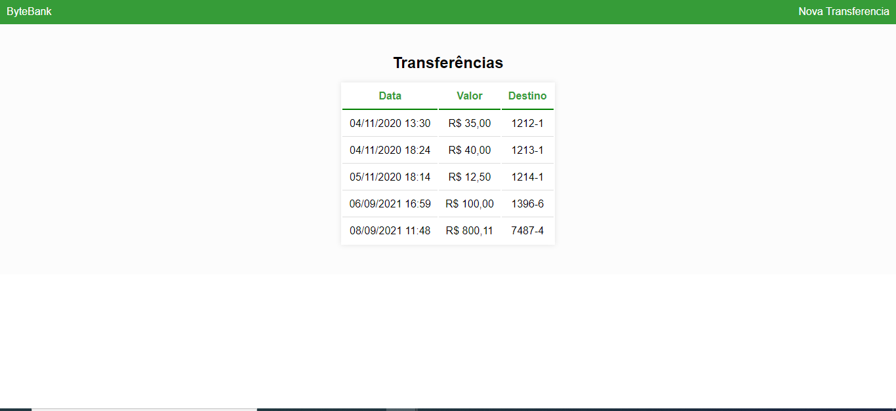
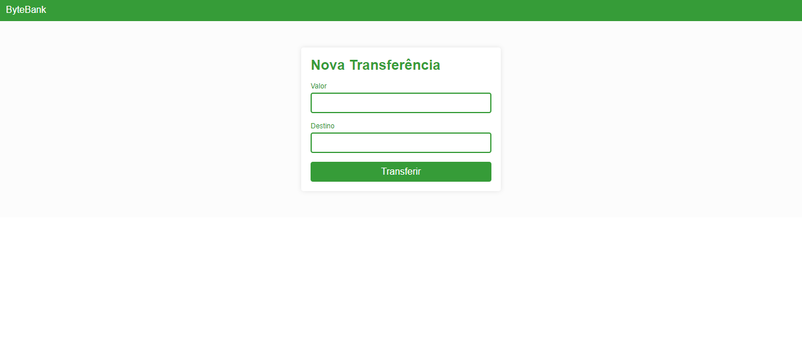
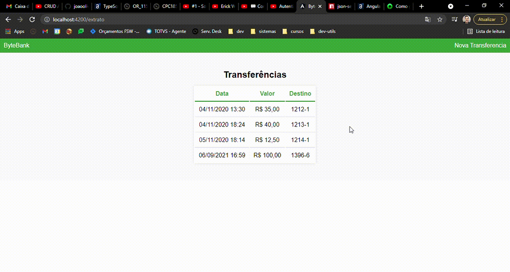

# Bytebank

Primeiro projeto angular criado para fins de estudo. Nesse projeto além dos principais conceitos do Framework angular, também pode ser ver:

- Utilização dos recursos do framework para acelerar o desenvolvimento
- Aprender a criar componentes
- Entender como transmitir informação entre componentes
- Integrar dados com API’s REST
- Transformar seus componentes em páginas

A aplicação consiste no velho exemplo de cadastro de transações bancárias, podendo ser inserido novas translações tanto como consultar o extrato. Todas informações são buscadas/inseridas de uma fakeapi utilizando o json-server.

Tela extrato.

Tela Nova Transação.

Demo.

Esse projeto foi desenvolvido durante a trilha de aprendizado sobre Angular da Alura. 
(https://www.alura.com.br/formacao-angular).
